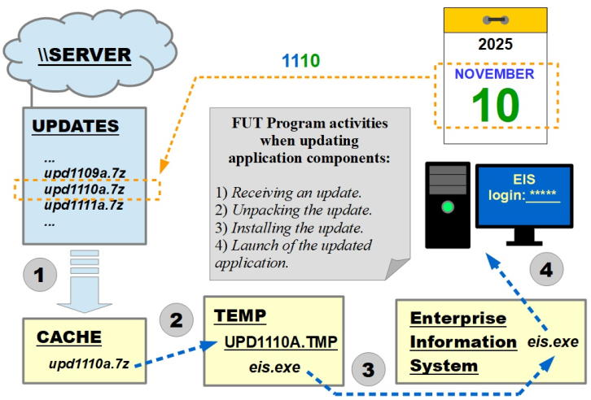

# File Update Tool

The File Update Tool (FUT) program is designed to automate the updating of interactive software for workstations.

The author of the FUT program is Ihar S. Areshchankau, robursw@gmail.com

This program is free software: you can redistribute it and/or modify it under
the terms of the GNU General Public License as published by the Free Software
Foundation, either version 3 of the License, or (at your option) any later
version.

This program is distributed in the hope that it will be useful, but WITHOUT
ANY WARRANTY; without even the implied warranty of MERCHANTABILITY or FITNESS
FOR A PARTICULAR PURPOSE. See the GNU General Public License for more details.

## DESCRIPTION

When installed on a computer, the FUT program performs the following actions upon startup (see the update diagram):
- Downloads date-stamped archives with files to be installed now or in the future from the update server (SMB/CIFS or HTTP).
- Extracts files from archives that correspond to the current calendar date and writes the files into the target directory.
- Records the update log in a log file or sends it to an HTTP server.
- Launches the application specified in the settings upon successful completion of the update procedure.

Features of the FUT program:
- Works in operating systems from Windows NT 4.0 to Windows 10.
- Doesn't depend on third-party software components.
- Installs both current and missed updates in chronological order.
- Protects critical files of the target system from modification during the update installation.
- Allows the task of delivering update archives to be assigned to other subsystems.

Update diagram.

```
SOURCE\upd1110a.7z
     |  (SERVER)
    ... 
     |  (WORKSTATION, November, 10th)
     v
CACHE\upd1110a.7z ---> TEMP\UPD1110A.TMP\... ---> TARGET\...
```



FUT program settings are stored in the _fut.ini_ file, and the name of the last processed update is recorded in the _state.txt_ file. The distribution package (see [Releases](https://github.com/R0bur/FUT/releases))
contains a ready-to-use demo environment.

## COMPILATION

1. Install FreeBASIC-1.10.1-win32 compiler to the folder
   _C:\FreeBASIC-1.10.1-win32_

2. Create a new folder and copy FUT program source files into it.

3. Run the _fut-build.bat_ script from the FUT program folder. It will create
   the _fut.exe_ executable file.

## INSTALLATION

1. Place the _fut.exe_ and _fut.ini_ files somewhere on the workstation.

2. Adjust the settings in the _fut.ini_ file to match the environment on the
   workstation.

3. Create a _state.txt_ file and specify in it the file name of the last
   processed (possibly virtually) update, for example:
   _LastUpdateFileName=upd1109c.7z_
   
4. Create a shorcut to start FUT progam and specify the command line, for
   example: _somefolder\fut.exe somefolder\fut.ini_

Please note that relative file system paths taken from the initialization
file will be calculated from the current folder, not from the folders
containing _fut.exe_ or _fut.ini_.
